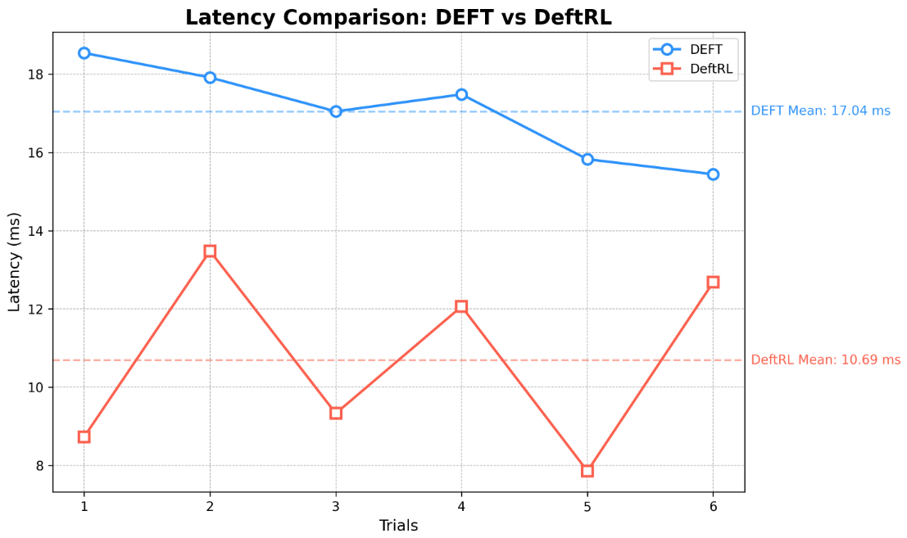
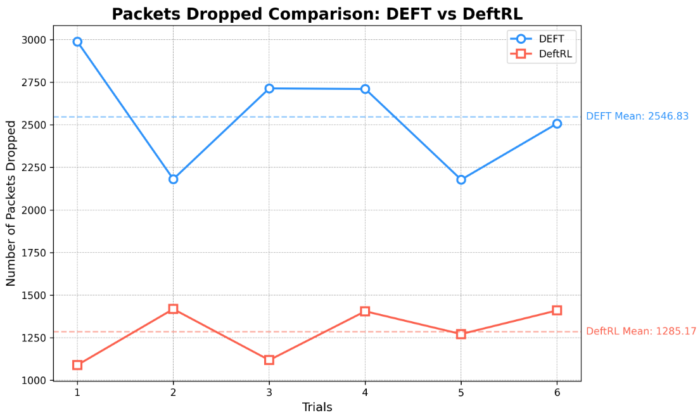
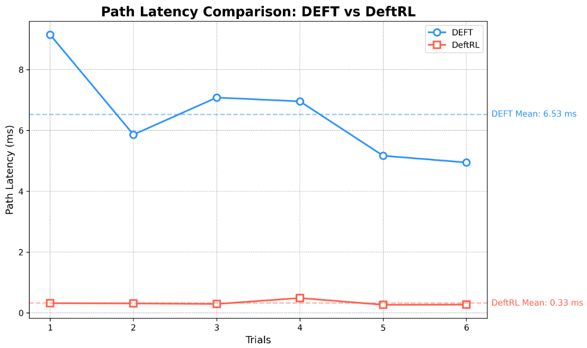
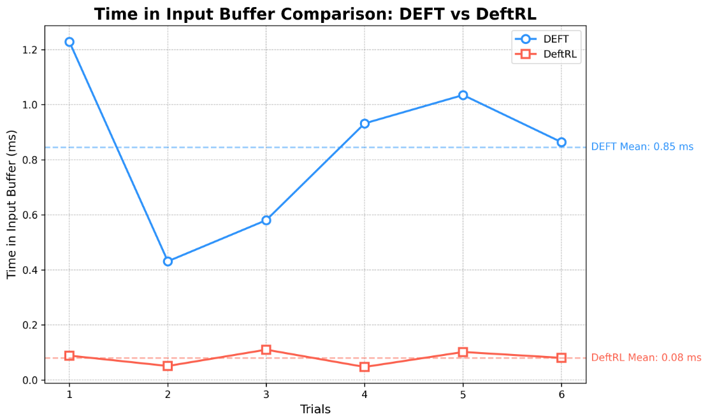
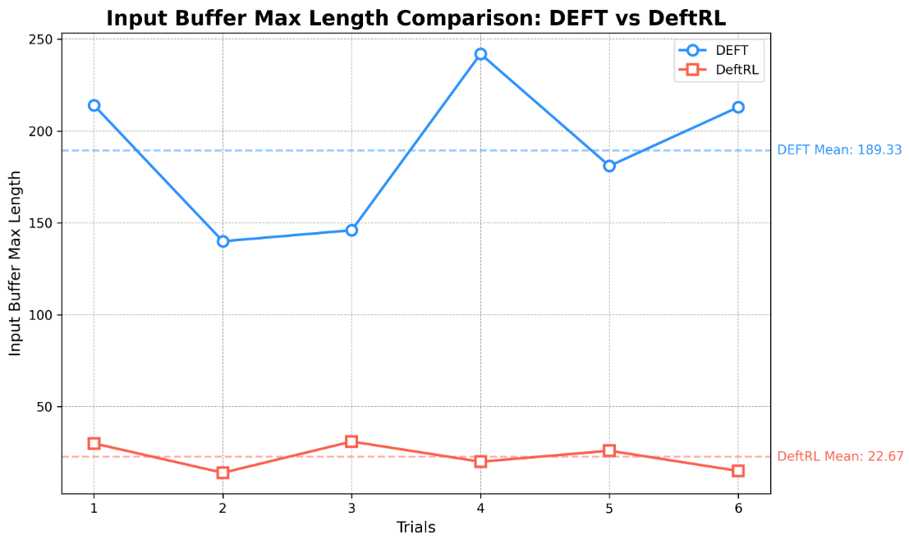

# Reinforcement Learning-driven Optimal Placement of Virtual Network Functions in a Distributed Network for Fault Tolerant State Replication and Migration

Read the baseline paper [DEFT]()

# Results
>
>
>
>
>
